# InvoiceFlow AI

An automated invoice processing pipeline built on local Large Language Models (via [Ollama](https://ollama.com)). The system extracts structured data from invoice images using a Vision LLM, normalizes vendor names through semantic and fuzzy matching, applies rule-based validation, performs AI-driven fraud detection, and cross-references invoices against purchase orders. A Streamlit dashboard provides batch upload, analytics, and human review.

---

## Table of Contents

- [Project Overview](#project-overview)
- [Architecture Overview](#architecture-overview)
- [System Flow](#system-flow)
- [Pipeline Logic](#pipeline-logic)
- [Data Model](#data-model)
- [Core Modules](#core-modules)
- [Security Model](#security-model)
- [LLM Integration](#llm-integration)
- [Setup & Installation](#setup--installation)
- [Running the Application](#running-the-application)
- [Testing](#testing)
- [Limitations](#limitations)
- [Future Improvements](#future-improvements)

---

## Project Overview

InvoiceFlow AI addresses the manual overhead of invoice verification in accounts payable workflows. It combines:

- **Vision-LLM OCR** — Extracts vendor name, invoice number, date, total amount, currency, and line items directly from invoice images, bypassing traditional OCR + regex pipelines.
- **Semantic Vendor Matching** — Uses vector embeddings and cosine similarity to resolve OCR-extracted vendor names against a master vendor list (e.g., "Amazon Mktp" → "Amazon Web Services").
- **Fuzzy Matching Fallback** — When semantic matching fails, falls back to token-based fuzzy matching via `rapidfuzz`.
- **Rule-Based Validation** — Detects duplicates, missing fields, and high-value invoices exceeding a $10,000 threshold.
- **AI Fraud Auditing** — A forensic-accountant LLM persona analyzes invoices for risk indicators (suspicious email domains, inconsistent tax rates, round-number totals, bank detail changes).
- **3-Way PO Matching** — Cross-references invoices against a purchase order database with $1.00 tolerance variance detection.
- **Interactive Dashboard** — Streamlit UI for batch upload, result review, drill-down audit, and approval workflow.

---

## Architecture Overview

The system is composed of five Python modules arranged in a layered architecture:

```
┌──────────────────────────────────────────────────────────────────────┐
│                           app.py                                     │
│                     Streamlit Dashboard                              │
│         File upload · Batch trigger · Result display · Audit view    │
└──────────────────────┬───────────────────────────────────────────────┘
                       │
          ┌────────────┴────────────┐
          ▼                         ▼
┌──────────────────┐    ┌───────────────────────────────────────────┐
│  ocr_engine.py   │    │            processor.py                   │
│  Vision-LLM OCR  │    │         Pipeline Orchestrator             │
│                  │    │                                           │
│ base64 encode    │    │  ┌─────────────┐  ┌────────────────────┐  │
│ POST /api/chat   │    │  │ vector_db.py│  │   erp_mock.py      │  │
│ llama3.2-vision  │    │  │ Semantic    │  │   Mock ERP / PO    │  │
│ JSON extraction  │    │  │ matching    │  │   3-way match      │  │
└──────────────────┘    │  └─────────────┘  └────────────────────┘  │
                        └───────────────────────────────────────────┘
```

### Module Dependency Graph

```
app.py
├── ocr_engine.py      (requests, base64, json)
└── processor.py        (pandas, rapidfuzz, requests, json)
    ├── vector_db.py    (requests, numpy)
    └── erp_mock.py     (no external deps)
```

| Module | Role | External Dependency |
|--------|------|-------------------|
| `app.py` | Streamlit dashboard — file upload, batch processing, result display, audit review | `streamlit`, `pandas`, `tempfile` |
| `ocr_engine.py` | Encodes images to base64, sends to Ollama Vision LLM, parses structured JSON | `requests`, `base64`, `json` |
| `processor.py` | Orchestrates vendor matching, validation, AI audit, and 3-way match | `pandas`, `rapidfuzz`, `requests`, `json` |
| `vector_db.py` | Generates embeddings via Ollama, computes cosine similarity for vendor matching | `requests`, `numpy` |
| `erp_mock.py` | In-memory purchase order database and 3-way match logic | None |

---

## System Flow

### Mermaid Diagram

```mermaid
flowchart TD
    A["User uploads PDF/Image files via Streamlit sidebar"] --> B["Save to NamedTemporaryFile"]
    B --> C["extract_invoice_data&#40;&#41;<br/>ocr_engine.py"]
    C --> D{"'error' key in response?"}

    D -- Yes --> E["Populate default fields:<br/>flags, vendor=Unknown,<br/>audit_risk_score=0,<br/>po_match_status=Skipped"]
    D -- No --> F["process_pipeline&#40;&#41;<br/>processor.py"]

    F --> G["smart_match_vendor&#40;&#41;<br/>vector_db.py"]
    G --> H{"Result contains<br/>'Unknown' or 'New Vendor'?"}
    H -- Yes --> I["match_vendor&#40;&#41;<br/>Fuzzy fallback via rapidfuzz"]
    H -- No --> J["Use vector match result"]
    I --> J

    J --> K["validate_invoice&#40;&#41;<br/>Duplicate · High Value · Missing Fields"]
    K --> L["Append to PROCESSED_DB via pd.concat"]
    L --> M["audit_invoice_with_ai&#40;&#41;<br/>Ollama llama3"]
    M --> N["check_3_way_match&#40;&#41;<br/>erp_mock.py"]
    N --> O["Return enriched dict"]

    E --> P["Collect results"]
    O --> P

    P --> Q["Display in Streamlit:<br/>DataFrame · Analytics · Per-invoice Audit View"]
    Q --> R["Cleanup temp file in finally block"]
```



### Step-by-Step Execution

| Step | Location | Action |
|------|----------|--------|
| 1 | `app.py` | User uploads one or more PDF/image files via `st.file_uploader` in the sidebar |
| 2 | `app.py` | Each file is written to a `tempfile.NamedTemporaryFile` with the original file extension |
| 3 | `ocr_engine.py` | File bytes are read and base64-encoded |
| 4 | `ocr_engine.py` | Base64 image is sent via `POST` to `http://localhost:11434/api/chat` using model `llama3.2-vision` with a structured extraction prompt |
| 5 | `ocr_engine.py` | Response content is stripped of markdown fences and parsed with `json.loads` |
| 6 | `app.py` | If OCR returns an `"error"` key, default fields are populated and the pipeline is skipped |
| 7 | `processor.py` | `smart_match_vendor()` generates an embedding via Ollama (`embeddinggemma`), computes cosine similarity against all vendor embeddings, returns best match if similarity > 0.6 |
| 8 | `processor.py` | If vector match returns "Unknown" or "New Vendor", `match_vendor()` is called as a fuzzy fallback using `rapidfuzz` with 80% threshold |
| 9 | `processor.py` | `validate_invoice()` checks for duplicate, high value (> $10,000), and missing invoice number |
| 10 | `processor.py` | Invoice is appended to `PROCESSED_DB` via `pd.concat` for future duplicate detection |
| 11 | `processor.py` | `audit_invoice_with_ai()` sends invoice JSON to Ollama `llama3` with a forensic-accountant prompt; returns `{risk_score, flags}` |
| 12 | `erp_mock.py` | `check_3_way_match()` scans invoice keys for substrings `"po"` and `"number"`, looks up the PO, and compares totals with $1.00 tolerance |
| 13 | `app.py` | Results are normalized into a DataFrame and displayed with total batch value and flagged-invoice count |
| 14 | `app.py` | Per-invoice audit view shows extracted data (JSON), validation flags, 3-way match status, and AI risk score |
| 15 | `app.py` | Temp file is deleted in a `finally` block regardless of success or failure |

---

## Pipeline Logic

`process_pipeline()` in `processor.py` is the central orchestrator. It executes four sequential stages with no retry or branching logic:

### Stage 1 — Vendor Normalization

1. Calls `vector_db.smart_match_vendor(raw_json.get('vendor_name'))`.
2. `smart_match_vendor` lazy-initializes `VENDOR_EMBEDDINGS` on first call by embedding all 7 vendors in the master list.
3. The input vendor name is embedded using the `embeddinggemma` model via Ollama's `/api/embeddings` endpoint.
4. Cosine similarity is computed against each stored vendor embedding.
5. If the best score exceeds 0.6, the corresponding vendor name is returned.
6. Otherwise, returns `"New Vendor ({ocr_name})"`, `"Unknown"`, `"Unknown (DB Init Failed)"`, or `"Unknown (Embedding Failed)"` depending on the failure point.
7. If the vector result contains "Unknown" or "New Vendor", `match_vendor()` is invoked as a fallback — it uses `rapidfuzz.process.extractOne` with `token_sort_ratio` against the 5-vendor `KNOWN_VENDORS` list with an 80% confidence threshold.

### Stage 2 — Rule-Based Validation

`validate_invoice()` produces a list of flag strings:

| Rule | Condition | Flag |
|------|-----------|------|
| Duplicate | `PROCESSED_DB` contains a row with matching `invoice_number` + `vendor_name` | `🔴 Duplicate Invoice Detected` |
| High Value | `float(total_amount) > 10000` | `🟠 High Value - Approval Needed` |
| Missing Number | `invoice_number` is falsy (`None`, empty string, or absent) | `🔴 Missing Invoice Number` |

After validation, the invoice is appended to `PROCESSED_DB` (a module-level `pandas.DataFrame`) so subsequent calls can detect duplicates.

### Stage 3 — AI Fraud Audit

`audit_invoice_with_ai()` sends the full invoice JSON to Ollama's `llama3` model with a forensic-accountant system prompt. The prompt instructs the LLM to check for:

- Changed bank details
- Free email domains (e.g., `@gmail`, `@yahoo`) for corporate vendors
- Inconsistent tax rates (expected 10–20%)
- Round-number totals (rare in B2B)

Returns `{"risk_score": 0-100, "flags": [...]}`. On non-200 response: `{"risk_score": 0, "flags": ["AI Audit Failed"]}`. On exception: `{"risk_score": 0, "flags": ["Audit unavailable"]}`.

### Stage 4 — 3-Way PO Match

`erp_mock.check_3_way_match()` performs:

1. **Key scanning** — Iterates invoice dict keys looking for any key where both `"po"` and `"number"` are substrings (case-insensitive).
2. **Explicit fallback** — If no key matched, checks `invoice_data.get('po_number')`.
3. **PO lookup** — Searches the `POS` dict for the PO number.
4. **Variance check** — Compares `float(total_amount)` against `total_approved` with $1.00 tolerance (`abs(variance) < 1.0`).

Returns one of: `"✅ Matched"`, `"❌ Variance of $X.XX"`, `"⚠️ PO Not Found"`, or `"⚠️ Error calculating variance"`.

---

## Data Model

### Invoice Object (dict)

The invoice flows through the pipeline as a Python dictionary. Fields are progressively added by each stage:

| Field | Type | Source | Description |
|-------|------|--------|-------------|
| `vendor_name` | `str` | OCR | Raw vendor name extracted from image |
| `invoice_number` | `str` | OCR | Invoice identifier |
| `invoice_date` | `str` | OCR | Date in `YYYY-MM-DD` format |
| `total_amount` | `float` | OCR | Invoice total (may arrive as string from OCR) |
| `currency` | `str` | OCR | Currency code (USD, EUR, etc.) |
| `line_items` | `list[dict]` | OCR | Each item: `{description, quantity, unit_price, total}` |
| `standardized_vendor` | `str` | Processor | Normalized vendor name after matching |
| `flags` | `list[str]` | Processor | Validation flag strings |
| `audit_risk_score` | `int` | Processor | 0–100 risk score from AI audit |
| `audit_flags` | `list[str]` | Processor | AI-generated warning strings |
| `po_match_status` | `str` | Processor | 3-way match result string |
| `filename` | `str` | App | Original uploaded filename (added by `app.py`) |

### PROCESSED_DB (module-level state)

```python
pd.DataFrame(columns=["invoice_number", "vendor", "total", "date"])
```

In-memory DataFrame in `processor.py`. Rows are appended via `pd.concat` after each `process_pipeline()` call. Used for duplicate detection. Resets on process restart.

### VENDOR_EMBEDDINGS (module-level state)

```python
dict[str, list[float]]  # vendor_name → embedding vector
```

In-memory cache in `vector_db.py`. Lazy-initialized on first `smart_match_vendor()` call by embedding all 7 entries in `VENDORS`. Persists for the lifetime of the process.

### POS (mock PO database)

```python
{
    "PO-1001": {"vendor": "Amazon Web Services", "total_approved": 5000.00, "items": ["Cloud Hosting"]},
    "PO-1002": {"vendor": "Staples", "total_approved": 250.50, "items": ["Paper", "Pens"]}
}
```

Hardcoded dictionary in `erp_mock.py`. Two purchase orders for demonstration.

---

## Core Modules

### `ocr_engine.py`

#### `extract_invoice_data(image_path: str) → dict`

Extracts structured invoice data from an image file using a Vision LLM.

- **Input**: File path to a PDF or image file.
- **Process**: Reads file bytes, base64-encodes them, sends a `POST` request to `http://localhost:11434/api/chat` with model `llama3.2-vision`. The request includes a system prompt (`SYSTEM_PROMPT`) that defines the expected JSON schema. Response content is stripped of markdown code fences and parsed with `json.loads`.
- **Output**: A dictionary containing the extracted fields, or `{"error": "OCR processing failed", "file": image_path}` on any exception.
- **Timeout**: 30 seconds on the HTTP request.

---

### `processor.py`

#### `process_pipeline(raw_json: dict) → dict`

Central orchestrator. Runs all four pipeline stages sequentially on a raw OCR output dictionary. Mutates and returns the input dictionary (adds `standardized_vendor`, `flags`, `audit_risk_score`, `audit_flags`, `po_match_status`).

- **Input**: Raw dictionary from `extract_invoice_data()`.
- **Output**: The same dictionary, enriched with validation and matching results.

#### `audit_invoice_with_ai(invoice_json: dict) → dict`

Sends invoice data to Ollama `llama3` with a forensic-accountant prompt requesting JSON output.

- **Input**: Invoice dictionary.
- **Output**: `{"risk_score": int, "flags": list[str]}`.
- **Failure modes**: Non-200 → `{"risk_score": 0, "flags": ["AI Audit Failed"]}`. Exception → `{"risk_score": 0, "flags": ["Audit unavailable"]}`.
- **Timeout**: 30 seconds.

#### `match_vendor(raw_name: str) → str`

Fuzzy-matches an OCR-extracted vendor name against the `KNOWN_VENDORS` list.

- **Input**: Raw vendor name string (or `None`/empty).
- **Process**: Uses `rapidfuzz.process.extractOne` with `fuzz.token_sort_ratio` scorer.
- **Output**: Best match if score > 80%, `"New Vendor ({raw_name})"` if below threshold, `"Unknown"` if input is falsy.

#### `validate_invoice(data: dict) → list[str]`

Applies deterministic business rules to the invoice data.

- **Input**: Invoice dictionary.
- **Output**: List of flag strings (may be empty).
- **Rules**: Duplicate check against `PROCESSED_DB`, high-value check (> $10,000 with `float()` coercion), missing invoice number check.

---

### `vector_db.py`

#### `smart_match_vendor(ocr_name: str) → str`

Semantic vendor matching using vector embeddings and cosine similarity.

- **Input**: OCR-extracted vendor name.
- **Process**: Lazy-initializes `VENDOR_EMBEDDINGS` if empty, generates input embedding via `embeddinggemma`, computes cosine similarity against all vendor embeddings.
- **Output**: Best-match vendor name if similarity > 0.6. Otherwise `"New Vendor ({ocr_name})"`, `"Unknown"`, `"Unknown (DB Init Failed)"`, or `"Unknown (Embedding Failed)"`.

#### `get_embedding(text: str, model: str = "nomic-embed-text") → list[float] | None`

Generates a vector embedding by calling Ollama's `/api/embeddings` endpoint.

- **Input**: Text to embed, model name.
- **Fallback**: If non-200 and model is not `"all-minilm"`, recursively retries with `model="all-minilm"`. Returns `None` on failure.
- **Timeout**: 30 seconds.

#### `cosine_similarity(v1, v2) → float`

Computes cosine similarity between two vectors using `numpy`.

- **Zero-vector guard**: Returns `0.0` if either vector has zero norm (prevents division by zero).

#### `initialize_vector_db() → None`

Pre-computes embeddings for all 7 vendors in the `VENDORS` list using the `embeddinggemma` model. Populates `VENDOR_EMBEDDINGS`. Vendors that fail to embed are silently skipped.

---

### `erp_mock.py`

#### `check_3_way_match(invoice_data: dict) → str`

Validates an invoice against the mock purchase order database.

- **Input**: Invoice dictionary.
- **Process**: Scans keys for `"po"` + `"number"` substrings, falls back to explicit `po_number` key, looks up PO, compares totals with $1.00 tolerance.
- **Output**: `"✅ Matched"`, `"❌ Variance of $X.XX"`, `"⚠️ PO Not Found"`, or `"⚠️ Error calculating variance"`.
- **Error handling**: `TypeError` and `ValueError` from `float()` conversion are caught.

---

### `app.py`

Streamlit dashboard — the application entry point.

| Component | Description |
|-----------|-------------|
| Sidebar file uploader | Accepts multiple PDF/image files via `st.file_uploader` |
| "Run Batch Process" button | Triggers the pipeline for all uploaded files |
| Processing Queue table | Displays filename, vendor, total, PO status, risk score via `st.dataframe` |
| Analytics panel | Shows total batch value (`st.metric`) and count of flagged invoices |
| Audit & Edit view | Per-invoice drill-down: extracted data (JSON), validation flags, 3-way match status, AI risk score and flags |
| "Approve & Push to ERP" button | UI placeholder — no backend handler is implemented |

---

## Security Model

The following protections are implemented in code:

| Protection | Implementation | Location |
|-----------|---------------|----------|
| Sanitized error messages | All `except` blocks return generic messages (`"OCR processing failed"`, `"Audit unavailable"`); raw exception details are not exposed to callers | `ocr_engine.py`, `processor.py` |
| HTTP timeouts | All three `requests.post` calls include `timeout=30` | `ocr_engine.py`, `processor.py`, `vector_db.py` |
| Temp file cleanup | `finally` block deletes temp files regardless of pipeline outcome | `app.py` |
| Typed exception handling | Variance calculation catches `(TypeError, ValueError)` specifically | `erp_mock.py` |
| OCR failure gate | Checks for `"error"` key before entering the processing pipeline | `app.py` |

**Not implemented:**

- No authentication or access control on the Streamlit app
- No input validation on uploaded file content or type
- No rate limiting on Ollama API calls
- No encryption of data in transit or at rest
- The "Approve & Push to ERP" button has no backend handler

---

## LLM Integration

All LLM interactions use the [Ollama](https://ollama.com) REST API at `http://localhost:11434`. No other providers are supported. No API keys are required.

### Models

| Model | Endpoint | Purpose | Module |
|-------|----------|---------|--------|
| `llama3.2-vision` | `/api/chat` | Extract structured data from invoice images | `ocr_engine.py` |
| `llama3` | `/api/chat` | Forensic fraud audit (JSON-mode response) | `processor.py` |
| `embeddinggemma` | `/api/embeddings` | Generate vector embeddings for vendor matching | `vector_db.py` |
| `all-minilm` | `/api/embeddings` | Fallback embedding model when `embeddinggemma` returns non-200 | `vector_db.py` |

### Fallback Behavior

- **Embedding models**: `get_embedding()` accepts a `model` parameter (default: `"nomic-embed-text"`). When called by `initialize_vector_db()` and `smart_match_vendor()`, the model is explicitly set to `"embeddinggemma"`. If the API returns non-200 and the current model is not `"all-minilm"`, the function recursively retries with `model="all-minilm"`. If that also fails, returns `None`.
- **OCR and audit models**: No fallback chain. If the model is unavailable, the function catches the exception and returns a sanitized error dict.

---

## Setup & Installation

### Prerequisites

- **Python 3.10+**
- **Ollama** installed and running locally ([install guide](https://ollama.com/download))

### Quickstart

```bash
# Clone the repository
git clone https://github.com/pypi-ahmad/invoiceflow-ai.git
cd invoiceflow-ai

# Create and activate virtual environment
python -m venv .venv

# Windows
.venv\Scripts\activate

# macOS / Linux
source .venv/bin/activate

# Install runtime dependencies
pip install -r requirements.txt

# Install test dependencies (development only)
pip install pytest pytest-cov pytest-mock
```

### Pull Ollama Models

```bash
ollama pull llama3.2-vision    # OCR extraction
ollama pull llama3              # Fraud audit
ollama pull embeddinggemma      # Vendor embeddings
ollama pull all-minilm          # Optional: fallback embedding model
```

### Dependencies

| Package | Purpose |
|---------|---------|
| `streamlit` | Web dashboard UI |
| `pandas` | DataFrame operations and duplicate tracking |
| `rapidfuzz` | Fuzzy string matching (vendor fallback) |
| `requests` | HTTP client for Ollama REST API |
| `numpy` | Cosine similarity computation |
| `watchdog` | Listed in `requirements.txt`; not imported in the codebase |
| `plotly` | Listed in `requirements.txt`; not imported in the codebase |

---

## Running the Application

```bash
# Ensure Ollama is running
ollama serve

# Start the dashboard
cd invoice-pipeline
streamlit run app.py
```

The application opens at `http://localhost:8501`.

**Workflow:**

1. Upload one or more invoice images/PDFs via the sidebar.
2. Click **Run Batch Process**.
3. View the processing queue table (filename, vendor, total, PO status, risk score).
4. Review analytics: total batch value and flagged invoice count.
5. Select an individual invoice to inspect extracted data, validation flags, 3-way match result, and AI audit details.

---

## Testing

### Quick Start

```bash
cd invoice-pipeline

# Run all tests
python -m pytest tests/ -v

# With coverage
python -m pytest tests/ --cov=. --cov-report=term-missing
```

### Summary

- **108 tests** — 0 failures, 0 skipped, 0 warnings
- **92% overall coverage** — all business-logic modules at 96–100%
- **Fully deterministic** — all Ollama HTTP calls and file I/O are mocked
- **State-isolated** — an `autouse` fixture in `conftest.py` resets `processor.PROCESSED_DB` before and after every test

### Test Files

| File | Tests | Scope |
|------|-------|-------|
| `tests/test_erp_mock.py` | 22 | PO data structure, 3-way match (exact, variance, not found), dynamic key scanning, error handling |
| `tests/test_vector_db.py` | 22 | Embedding generation, model fallback, cosine similarity (identical, orthogonal, zero-vector), DB initialization, smart match |
| `tests/test_ocr_engine.py` | 12 | System prompt structure, successful extraction, markdown fence stripping, HTTP errors, malformed JSON, file not found, connection failure |
| `tests/test_processor.py` | 30 | Audit function (success, non-200, connection error, malformed JSON), fuzzy match, validation rules, full pipeline orchestration, vector→fuzzy fallback |
| `tests/test_integration.py` | 22 | End-to-end pipeline, OCR error propagation, vendor fallback chain, 3-way match with real `erp_mock`, data type edge cases, duplicate detection across calls |
| **Total** | **108** | |

### Coverage

| Module | Coverage | Notes |
|--------|----------|-------|
| `erp_mock.py` | 100% | — |
| `ocr_engine.py` | 100% | — |
| `vector_db.py` | 100% | — |
| `processor.py` | 96% | Lines 100–101 uncovered (duplicate flag branch; validated via integration tests) |
| `app.py` | 0% | Streamlit UI; requires running server, not unit-testable without browser harness |
| **Overall** | **92%** | |

---

## Project Structure

```
invoice-pipeline/
├── app.py                 # Streamlit dashboard (upload, batch process, review)
├── ocr_engine.py          # Vision-LLM OCR via Ollama (llama3.2-vision)
├── processor.py           # Pipeline orchestrator (vendor match, validate, audit, 3-way)
├── vector_db.py           # Semantic vendor matching (embeddings + cosine similarity)
├── erp_mock.py            # Mock ERP/PO database and 3-way match logic
├── conftest.py            # Shared pytest fixtures and PROCESSED_DB auto-reset
├── setup.cfg              # pytest configuration
├── requirements.txt       # Runtime dependencies
├── TEST_REPORT.md         # Detailed test and fix report
├── tests/
│   ├── __init__.py
│   ├── test_erp_mock.py
│   ├── test_ocr_engine.py
│   ├── test_processor.py
│   ├── test_vector_db.py
│   └── test_integration.py
└── README.md
```

---

## Limitations

These are concrete constraints identified from the codebase:

1. **Ollama required at runtime** — All LLM calls target `http://localhost:11434`. If Ollama is not running, OCR returns `{"error": "OCR processing failed"}`, audit returns `{"risk_score": 0, "flags": ["Audit unavailable"]}`, and vendor matching returns `"Unknown"`. There is no remote API fallback.

2. **In-memory state only** — `PROCESSED_DB` (duplicate tracking) and `VENDOR_EMBEDDINGS` (vendor embedding cache) are module-level Python globals. They reset on every process restart. There is no persistent storage.

3. **Mock PO data** — `erp_mock.POS` contains exactly two hardcoded purchase orders (`PO-1001`, `PO-1002`). There is no real ERP integration; the "Approve & Push to ERP" button in the UI has no backend handler.

4. **No authentication** — The Streamlit application has no login, session management, or access control.

5. **Single-process only** — Duplicate detection relies on a module-level DataFrame. It does not function across multiple workers, threads, or server restarts.

6. **Streamlit UI untested** — `app.py` has 0% test coverage. It requires a running Streamlit server and cannot be unit-tested without browser automation.

7. **Unused dependencies** — `watchdog` and `plotly` are declared in `requirements.txt` but not imported anywhere in the codebase.

8. **No PDF text extraction** — `ocr_engine.py` sends raw file bytes as a base64-encoded image to the Vision LLM. It does not extract text from PDFs; the model must visually read the rendered document.

9. **Hardcoded thresholds** — Vendor similarity (0.6), fuzzy confidence (80%), high-value flag ($10,000), and PO variance tolerance ($1.00) are all hardcoded constants, not configurable via environment variables.

10. **No CI/CD pipeline** — There is no GitHub Actions workflow, Makefile, or automation. Tests must be run manually.

11. **False-positive key scanning** — `check_3_way_match()` scans all dict keys for substrings `"po"` and `"number"`. Keys like `"report_number"` (where `"po"` appears in `"report"`) will incorrectly match as a PO reference.

12. **Input dict mutation** — `process_pipeline()` mutates the input dictionary in-place rather than returning a copy. The caller's original data is modified as a side effect.

---

## Future Improvements

The following are grounded in patterns observable in the codebase (code comments, unused dependencies, or documented constraints):

- **Persistent vector store** — `vector_db.py` comments reference ChromaDB and Qdrant as production alternatives to the in-memory dict.
- **Real ERP integration** — `erp_mock.py` comments reference SAP, Oracle, and NetSuite as real-world data sources for the `check_3_way_match` interface.
- **Configurable thresholds** — Moving the five hardcoded thresholds to environment variables would align with 12-factor conventions.
- **File watcher** — `watchdog` is listed as a dependency with the comment *"To watch folders for new files."* A folder-watcher mode could automate incoming invoice processing.
- **Structured logging** — Replacing `print()` calls with Python's `logging` module would improve observability.
- **CI/CD automation** — Adding a GitHub Actions workflow to run `pytest` on push would enforce the existing test coverage gate.
