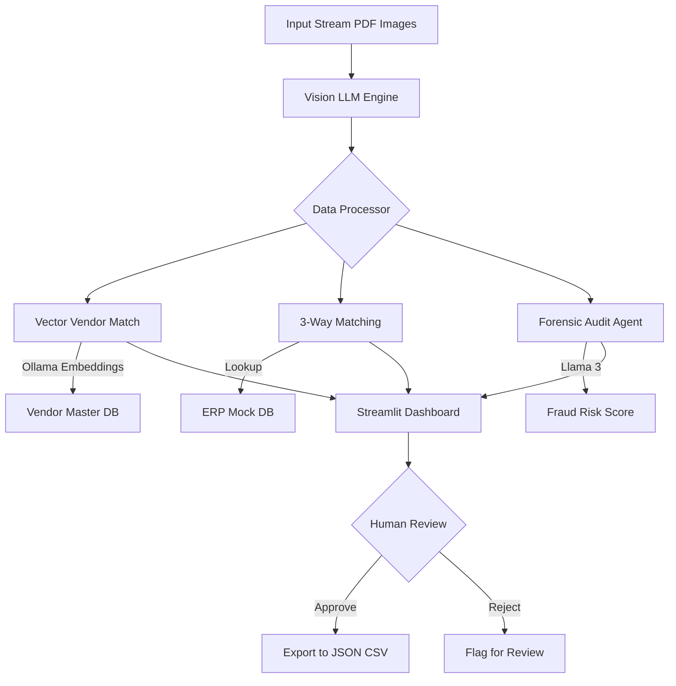

# 🧾 InvoiceFlow AI: Intelligent Accounts Payable Automation


**InvoiceFlow AI** is an enterprise-grade automated pipeline for processing invoices and Purchase Orders (POs). Unlike traditional regex-based parsers, it utilizes **Computer Vision (Llama 3.2 Vision)** to read untemplated documents and **Generative AI (Llama 3)** to perform forensic audits for fraud detection.

It features a "Human-in-the-Loop" dashboard for reviewing flagged discrepancies, making it a complete solution for modern Finance teams.

---

## 🚀 Key Features

### 1. 🧠 Semantic Vendor Matching (RAG)
- **Problem:** "Amazon Web Services", "AWS", and "Amzn Mktp" are the same vendor but look different to simple code.
- **Solution:** Uses **EmbeddingGemma** (via Ollama) and a custom **Vector Store** (Cosine Similarity) to match vendors based on *semantic similarity*, not just spelling.

### 2. 🕵️‍♂️ AI Forensic Auditor
- **Fraud Detection:** An AI agent (Llama 3) reviews every invoice for red flags:
  - 🚩 Generic email domains (@gmail, @yahoo) for corporate vendors.
  - 🚩 Round-number totals (e.g., $5,000.00) often associated with fake bills.
  - 🚩 Sudden changes in bank account details.
  - 🚩 Inconsistent tax calculations.

### 3. ⚖️ Automated 3-Way Matching
- Cross-references extracted Invoice data against a mock **ERP / Purchase Order Database**.
- Automatically flags variances between the *Authorized PO Amount* and the *Billed Invoice Amount*.

### 4. 📄 Vision-LLM Extraction
- Uses **Llama 3.2 Vision** to extract structured data (Line Items, Tax ID, Dates) from PDF/Image invoices without needing rigid templates or bounding boxes.

---

## 🛠️ Architecture



---

## 📦 Installation

### Prerequisites

1. **Python 3.10+**
2. **Ollama** installed locally and running.

### Setup

1. **Clone the repository**
   ```bash
   git clone <repository_url>
   cd invoice-pipeline
   ```

2. **Install dependencies**
   ```bash
   pip install -r requirements.txt
   ```

3. **Pull Required AI Models**
   You need to have Ollama running (`ollama serve`). Then pull the following models:
   ```bash
   # Vision Model for OCR/Extraction
   ollama pull llama3.2-vision
   
   # Chat Model for Fraud Analysis
   ollama pull llama3
   
   # Embedding Model for Vendor Matching
   ollama pull embeddinggemma
   ```

---

## 🏃‍♂️ Usage

1. **Start the Dashboard**
   ```bash
   streamlit run app.py
   ```

2. **Workflow**
   * **Upload:** Drag & Drop a batch of PDF/Image invoices into the sidebar.
   * **Process:** Click "Run Batch Process". The AI will extract data, match vendors, and check against POs.
   * **Review:** 
     * 🔴 **Red Flags:** Duplicate invoices, missing POs, or fraud risks.
     * 🟢 **Green Flags:** Clean matches ready for payment.
   * **Audit:** Click on any invoice to see the raw extracted JSON side-by-side with the validation logic and AI audit results.

---

## 📂 Project Structure

```text
invoice-pipeline/
├── app.py                # Streamlit Dashboard & UI Logic
├── processor.py          # Validation Logic (3-Way Match, Business Rules, AI Audit)
├── ocr_engine.py         # Vision-LLM Wrapper (Llama 3.2 Vision)
├── vector_db.py          # Semantic Vendor Matching (Embeddings + Cosine Similarity)
├── erp_mock.py           # Simulated ERP Database (PO Records)
├── requirements.txt      # Python Dependencies
└── README.md             # Documentation
```

---

## 🔮 Future Roadmap

* [ ] Integration with Quickbooks/Xero API.
* [ ] Email ingestion (IMAP) to auto-process attachments.
* [ ] Multi-page table extraction improvements.
* [ ] Switch to persistent Vector DB (ChromaDB/Qdrant) for production.

---

## 📄 License

MIT License
